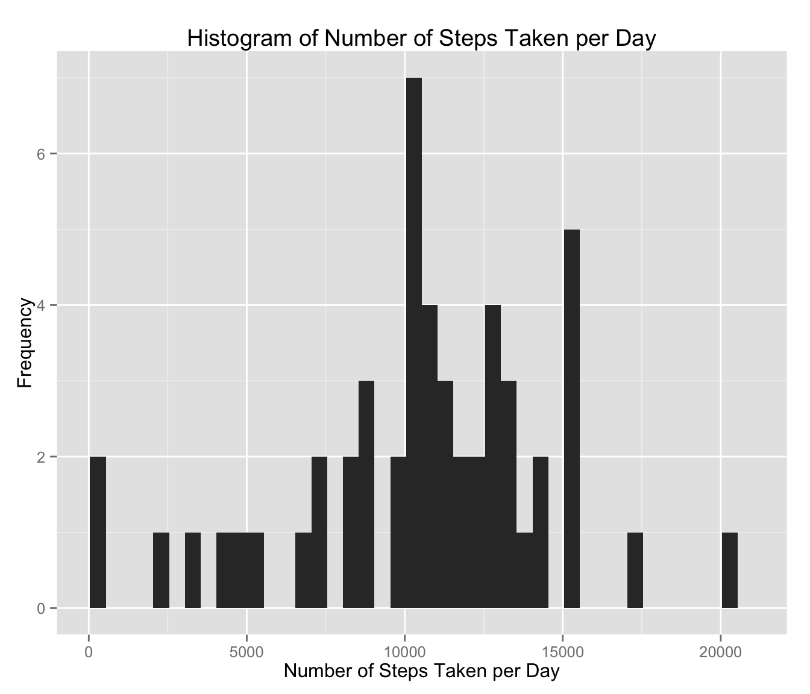
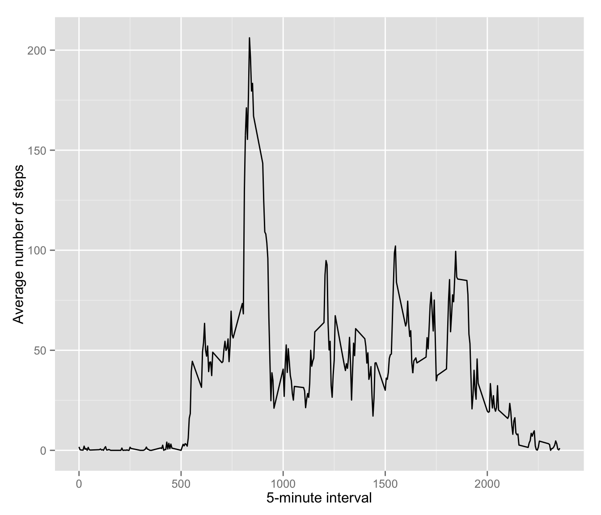
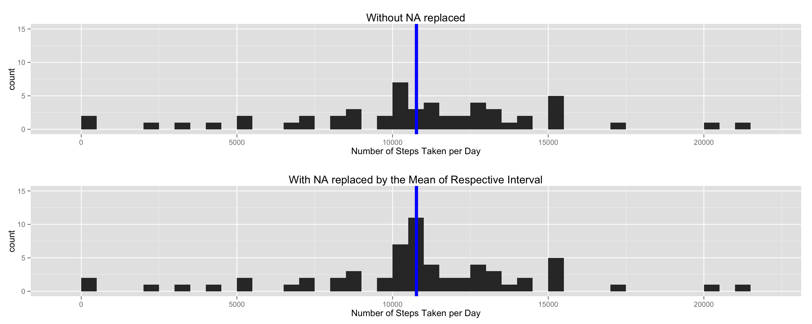
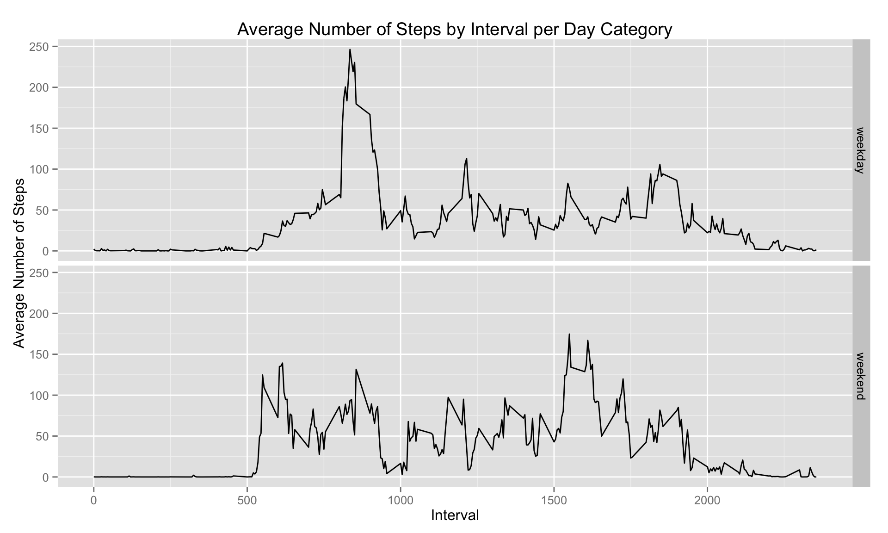

# Reproducible Research: Peer Assessment 1

## Load Libraries


## Data Loading

```r
if(! file.exists("activity.csv")) { unzip("activity.zip") }
activity.data <- read.csv("activity.csv")
```

### Data Cleansing
Convert the date field to Date class and remove records where steps is NA

```r
activity.data$date <- as.Date(activity.data$date)
activity.data$hr <- activity.data$interval %/% 100
activity.data$min <- activity.data$interval %% 100
activity.data.wo.na <- activity.data[! is.na(activity.data$steps),]
```
### Summarize 

```r
ttl.steps.by.date <- ddply(activity.data.wo.na,.(date),summarize,steps=sum(steps,rm.na=TRUE))
avg.steps.by.interval <- ddply(activity.data.wo.na,.(interval),summarize,steps=mean(steps))
```

### Histogram of total steps taken per day

```r
ggplot(ttl.steps.by.date, aes(ttl.steps.by.date$steps)) + geom_histogram(breaks=seq(min(ttl.steps.by.date$steps),max(ttl.steps.by.date$steps),by =500)) + labs(x="Number of Steps Taken per Day",y="Frequency",title="Histogram of Number of Steps Taken per Day")
```



## What is mean total number of steps taken per day?

```r
ttl.steps.by.date.mean <- mean(ttl.steps.by.date$steps)
```
Average Number of Steps per Day is **10,767**

### Median Number of Steps per Day

```r
ttl.steps.by.date.median <- median(ttl.steps.by.date$steps)
```
Median Number of Steps per Day is **10,766**

## What is the average daily activity pattern?

```r
ggplot(avg.steps.by.interval,aes(x=avg.steps.by.interval$interval,y=avg.steps.by.interval$steps)) + geom_line(stat="identity") + labs(y="Average number of steps",x="5-minute interval")
```



### Which 5-minute interval, on average across all the days in the dataset, contains the maximum number of steps?

```r
max.steps.interval <- avg.steps.by.interval[which.max(avg.steps.by.interval$steps),]$interval
```
The **835** interval contains on average the maximum number of steps

## Imputing missing values
### Number of records with missing number of steps

```r
nb.rows.missing.steps <- nrow(activity.data[is.na(activity.data$steps),])
```
The number of records with missing number of steps is **2304**

Generate data table including NA

```r
activity.data.tb <- data.table(activity.data)
```
Add new column containing mean of the interval across all days

**Note**: 

- I chose as interval the mean by interval rather than the mean by day because some day have no data at all, hence returning a mean of NA

```r
activity.data.tb <- activity.data.tb[,avgsteps:=mean(steps,na.rm=TRUE),by=interval]
```
Create new data frame replacing NA steps with average steps for respective interval

```r
activity.data.fix.na <- as.data.frame(activity.data.tb)
rm(activity.data.tb)
activity.data.fix.na[is.na(activity.data.fix.na$steps),]$steps <- activity.data.fix.na[is.na(activity.data.fix.na$steps),]$avgsteps
```

**Note:** 

- I place both plots next to each other to be able to compare more easily, and set the y axis limit to be the same on both histograms.


```r
ttl.steps.by.date.fix.na <- ddply(activity.data.fix.na,.(date),summarize,steps=sum(steps,rm.na=TRUE))
plot1 <- ggplot(ttl.steps.by.date, aes(ttl.steps.by.date$steps)) + geom_histogram(binwidth=500) + labs(x="Number of Steps Taken per Day",title="Without NA replaced") + geom_vline(color="blue",xintercept = mean(ttl.steps.by.date$steps),lwd=2) + ylim(0,15)
plot2 <- ggplot(ttl.steps.by.date.fix.na, aes(ttl.steps.by.date.fix.na$steps)) + geom_histogram(binwidth=500) + labs(x="Number of Steps Taken per Day",title="With NA replaced by the Mean of Respective Interval") + geom_vline(color="blue",xintercept = mean(ttl.steps.by.date.fix.na$steps),lwd=2) + ylim(0,15)
grid.arrange(plot1,plot2)
```


Average Number of Steps per Day when NA are replaced with average steps for each interval

```r
ttl.steps.by.date.fix.na.mean <- mean(ttl.steps.by.date.fix.na$steps)
```
Average Number of Steps per Day when NA are replaced with average steps for each interval: **10,767**


```r
ttl.steps.by.date.fix.na.median <- median(ttl.steps.by.date.fix.na$steps)
```
Median Number of Steps per Day when NA are replaced with average steps for each interval: **10,767**

**Findings:**

1. In this dataset, fixing NA doesn't affect the median total number of steps taken per day as NA are only found across an entire day rather than in specific interval
2. The frequency at the mean is higher, which makes sense since we have replaced NA with the average number of steps, hence creating more data at the mean. Other buckets are unchanged.

# Weekdays vs Weekends
Add the day category (daycat) factor to the data frame

```r
activity.data.fix.na$daycat <- weekdays(activity.data.fix.na$date)
activity.data.fix.na[! (activity.data.fix.na$daycat %in% c("Saturday","Sunday")),]$daycat <- "weekday"
activity.data.fix.na[activity.data.fix.na$daycat %in% c("Saturday","Sunday"),]$daycat <- "weekend"
activity.data.fix.na$daycat <- as.factor(activity.data.fix.na$daycat)
```
Plot the steps by day category using Lattice plotting system

```r
# avg.nb.steps.per.interval.per.daycat <- ddply(activity.data.fix.na,.(interval,daycat),summarize,avgsteps=mean(steps))
ggplot(activity.data.fix.na, aes(x=activity.data.fix.na$interval,y=activity.data.fix.na$steps)) + stat_summary(fun.y="mean", geom="line") + facet_grid(daycat ~ .) + labs(x="Interval",y="Average Number of Steps",title="Average Number of Steps by Interval per Day Category")
```


**Findings:**

1. This person is active earlier on week-ends but has a higher peak of activity on week-days, in mid morning
2. In the early afternoon, he is rather equally active on both week-ends and week-days
3. He seems to get up at around the same time every day, week-days and week-ends, around 5:00AM and goes to bed around 11:00PM
