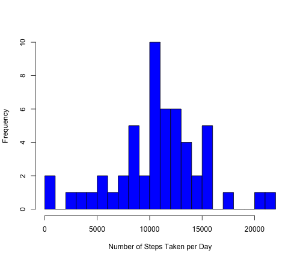
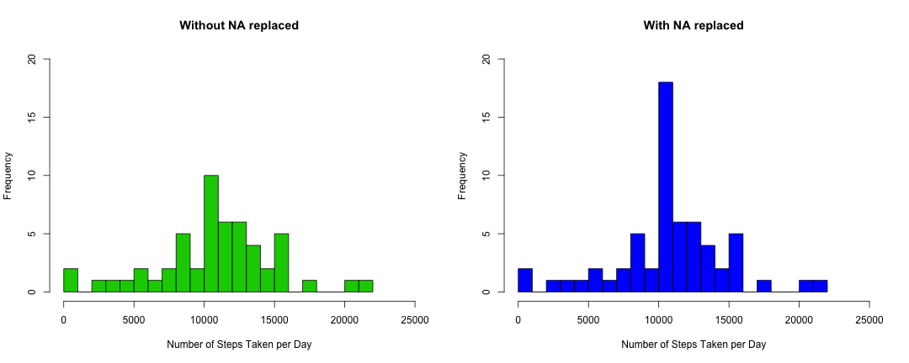
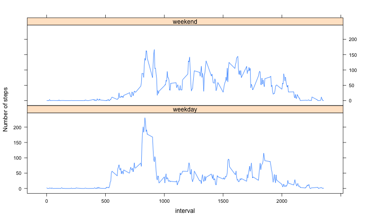

# Reproducible Research: Peer Assessment 1

## Load Libraries

```r
library(data.table)
library(plyr)
```


## Data Loading

```r
unzip("activity.zip")
activity.data <- read.csv("activity.csv")
```


### Data Cleaning
Convert the date field to Date class and remove records where steps is NA or 0

```r
activity.data$date <- as.Date(activity.data$date)
activity.data.wo.na <- activity.data[!is.na(activity.data$steps), ]
```

### Summarize 

```r
ttl.steps.by.date <- ddply(activity.data.wo.na, .(date), summarize, steps = sum(steps, 
    rm.na = TRUE))
avg.steps.by.interval <- ddply(activity.data.wo.na, .(interval), summarize, 
    steps = mean(steps))
```


### Histogram of total steps taken per day

```r
hist(ttl.steps.by.date$steps, col = 4, main = "", xlab = "Number of Steps Taken per Day", 
    breaks = 25)
```

 


## What is mean total number of steps taken per day?
### Average Number of Steps per Day

```r
mean(ttl.steps.by.date$steps)
```

```
## [1] 10767
```

### Median Number of Steps per Day

```r
median(ttl.steps.by.date$steps)
```

```
## [1] 10766
```


## What is the average daily activity pattern?

```r
plot(avg.steps.by.interval, type = "l", ylab = "Average number of steps")
```

 


## Imputing missing values
### Number of records with missing number of steps

```r
nrow(activity.data[is.na(activity.data$steps), ])
```

```
## [1] 2304
```

Generate data table including NA

```r
activity.data.tb <- data.table(activity.data)
```

Add new column containing mean of the interval across all days
Note: Chose interval means rather than day because some day have no data at all, hence returning a mean of NA

```r
activity.data.tb <- activity.data.tb[, `:=`(avgsteps, mean(steps, na.rm = TRUE)), 
    by = interval]
```

Create new data frame replacing NA steps with average steps for respective interval

```r
activity.data.fix.na <- as.data.frame(activity.data.tb)
rm(activity.data.tb)
activity.data.fix.na[is.na(activity.data.fix.na$steps), ]$steps <- activity.data.fix.na[is.na(activity.data.fix.na$steps), 
    ]$avgsteps
```

Histogram of Number of Steps by day following same process as earlier on
Note: Putting both plots next to each other to more easily compare

```r
ttl.steps.by.date.fix.na <- ddply(activity.data.fix.na, .(date), summarize, 
    steps = sum(steps, rm.na = TRUE))
par(mfrow = c(1, 2))
hist(ttl.steps.by.date$steps, col = 3, xlab = "Number of Steps Taken per Day", 
    breaks = 25, main = "Without NA replaced", ylim = c(0, 20), xlim = c(0, 
        25000))
hist(ttl.steps.by.date.fix.na$steps, col = 4, xlab = "Number of Steps Taken per Day", 
    breaks = 25, main = "With NA replaced", ylim = c(0, 20), xlim = c(0, 25000))
```

 

Average Number of Steps per Day when NA are replaced with average steps for each interval

```r
mean(ttl.steps.by.date.fix.na$steps)
```

```
## [1] 10767
```

Median Number of Steps per Day when NA are replaced with average steps for each interval

```r
median(ttl.steps.by.date.fix.na$steps)
```

```
## [1] 10767
```

<B>Findings: </B>
* In this dataset, fixing NA doesn't affect the mean number of steps taken per day as we are replacing NA with mean values by interval
* The frequency at the mean is higher, which makes sense since we have replaced NA with the average number of steps, hence creating more data at the mean. Other buckets are unchanged.

# Weekdays vs Weekends
Add the day category (daycat) factor to the data frame

```r
activity.data.fix.na$daycat <- weekdays(activity.data.fix.na$date)
activity.data.fix.na[!(activity.data.fix.na$daycat %in% c("Saturday", "Sunday")), 
    ]$daycat <- "weekday"
activity.data.fix.na[activity.data.fix.na$daycat %in% c("Saturday", "Sunday"), 
    ]$daycat <- "weekend"
activity.data.fix.na$daycat <- as.factor(activity.data.fix.na$daycat)
```

Plot the steps by day category using Lattice plotting system

```r
library(lattice)
avg.nb.steps.per.interval.per.daycat <- ddply(activity.data.fix.na, .(interval, 
    daycat), summarize, avgsteps = mean(steps))
xyplot(avgsteps ~ interval | daycat, data = avg.nb.steps.per.interval.per.daycat, 
    type = "l", layout = c(1, 2), ylab = "Number of steps")
```

 

<B>Findings:</B>
* This person walks more earlier in the morning on week days
* A higher peak mid morning may denote his commuting time
* On week-ends, he probably gets up later than weeks days but is more active in the afternoon
